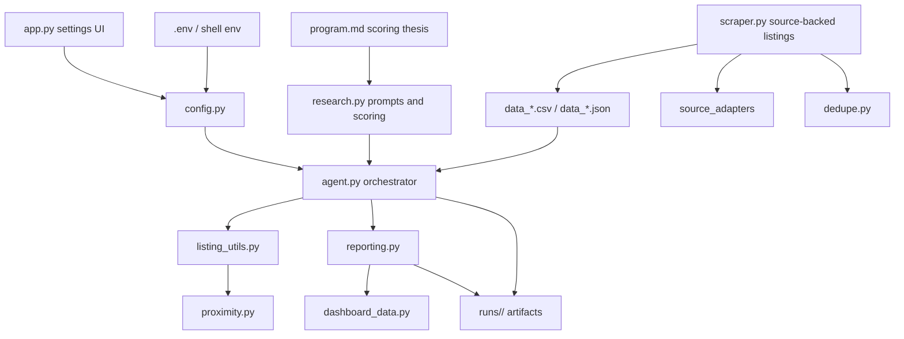

# autobiz Architecture

autobiz is a local research pipeline for finding, enriching, scoring, and
ranking small business acquisition candidates. The current target workflow is
Philadelphia-first discovery with statewide Pennsylvania coverage.

## System Goals

- Prefer source-backed listings over generated examples.
- Rank businesses by seller-finance viability, not just asking price.
- Preserve listing facts such as source URL, location, and Philly proximity
  across every stage.
- Keep prompts and scoring rubrics easy to tune without touching orchestration.
- Save run artifacts so past decisions are searchable and comparable.

## Module Map

| Module | Responsibility |
| --- | --- |
| `app.py` | Flask dashboard/settings shell and local browser auto-open. |
| `config.py` | Loads `config.json`, project `.env` files, shell env, and built-in defaults. Creates provider clients. |
| `scraper.py` | Source-backed listing collection. Direct Craigslist scrape plus Grok-proxied listing sites. |
| `source_adapters/` | Per-source scraping or URL-building adapters. |
| `dedupe.py` | Fuzzy cross-source duplicate detection and merge logic. |
| `dashboard_data.py` | Shared dashboard and static HTML report data shaping. |
| `research.py` | Shared discovery, market enrichment, scoring prompt, scoring math, and deep-dive logic. |
| `agent.py` | Orchestrates discovery, scoring workers, verification, deep dives, run artifacts, and git history. |
| `listing_utils.py` | Shared listing metadata preservation, price filtering, source summaries, and proximity ranking helpers. |
| `proximity.py` | Approximate Philly distance, bucket, city, county, and proximity rank enrichment. |
| `reporting.py` | Text and static HTML report rendering for agent runs. |
| `program.md` | Human-editable acquisition thesis and scoring rubric. |
| `runs/` | Timestamped run artifacts: discovered listings, scored results, reports, deep dives, and metadata. |

## Data Flow

## Agent Run Lifecycle

1. Load config, program, seen fingerprints, and findings history.
2. Discover listings from a JSON input or parallel Grok search agents.
3. Normalize and filter by asking-price range.
4. Add Philly proximity fields and proximity ranks.
5. Save `discovered.json`.
6. Score listings in parallel with configurable scoring workers.
7. Attach original source/proximity metadata back onto model results.
8. Apply hard rules for score caps and margin sanity.
9. Verify the top candidate URLs through Grok, unless disabled.
10. Run deep dives on the top candidates, unless disabled.
11. Render the text report and static HTML dashboard report.
12. Save `scored.json`, `deep_dives.json`, `report.txt`, `dashboard.html`, and `meta.json`.
13. Update cross-run memory and optionally commit the run artifacts.

## Source-Backed vs Estimated Records

The discovery prompt now asks for source-backed listings only. If a record has
`source_url = "estimated"` or no URL, it is treated as an estimate and capped
below A-tier. The main report separates verified/source-backed records from
estimated benchmark records.

Each scored or scraped listing also gets `financial_confidence`, including
field-level provenance for asking price, cash flow, revenue, and source. This
keeps scraped facts, LLM-extracted facts, estimates, and missing values visible
in both the live dashboard and run artifacts.

## Proximity Model

`proximity.py` does not geocode full street addresses. It uses city, county, and
source-market heuristics to produce an approximate distance from Philadelphia.
That is intentional: the goal is fast triage, not navigation-grade routing.

Fields added to listing and scored outputs:

- `city`
- `county`
- `distance_to_philly_miles`
- `proximity_bucket`
- `proximity_rank`

## Run Metadata

`meta.json` includes:

- budget and location inputs
- worker and verification settings
- source and proximity breakdowns
- timing for discovery, scoring, verification, and deep-dive stages
- tier counts and top-pick summary

This gives each run enough context to compare data quality and runtime without
opening every artifact manually.
